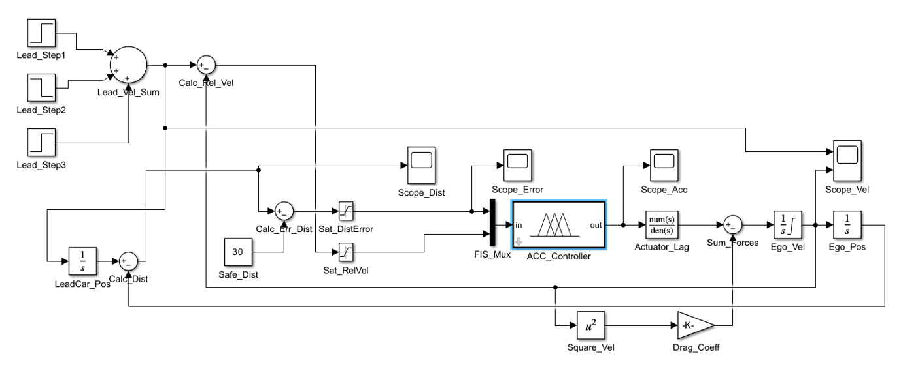
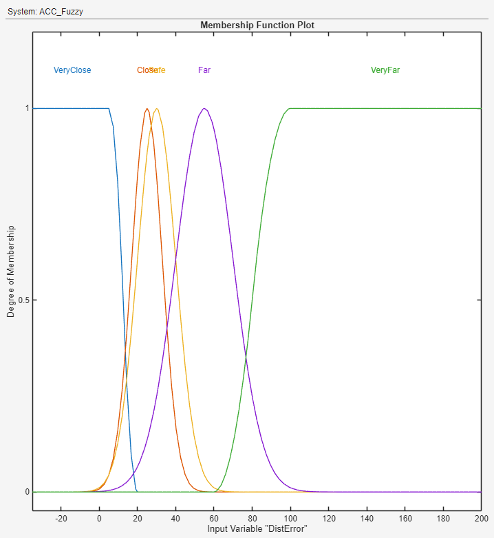
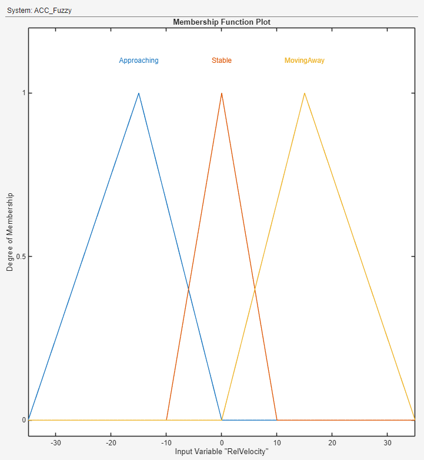
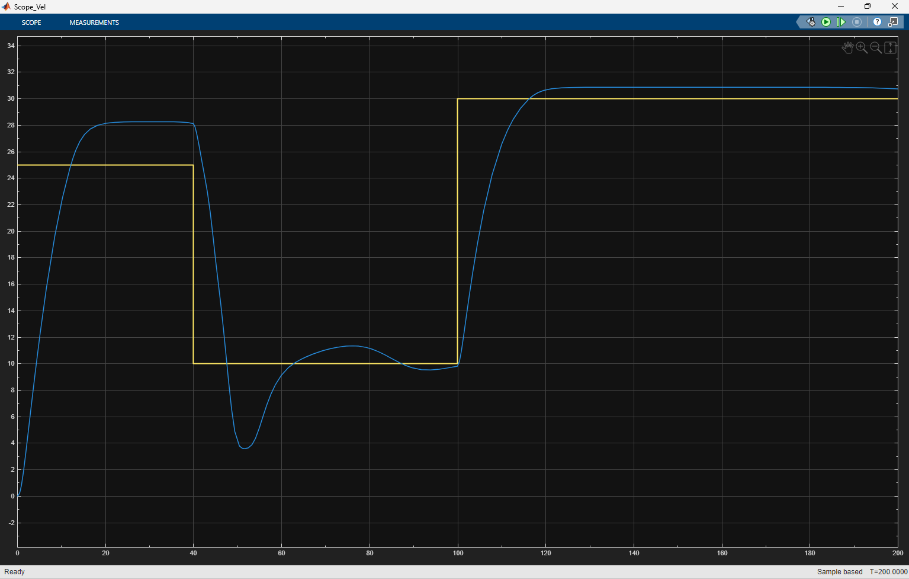
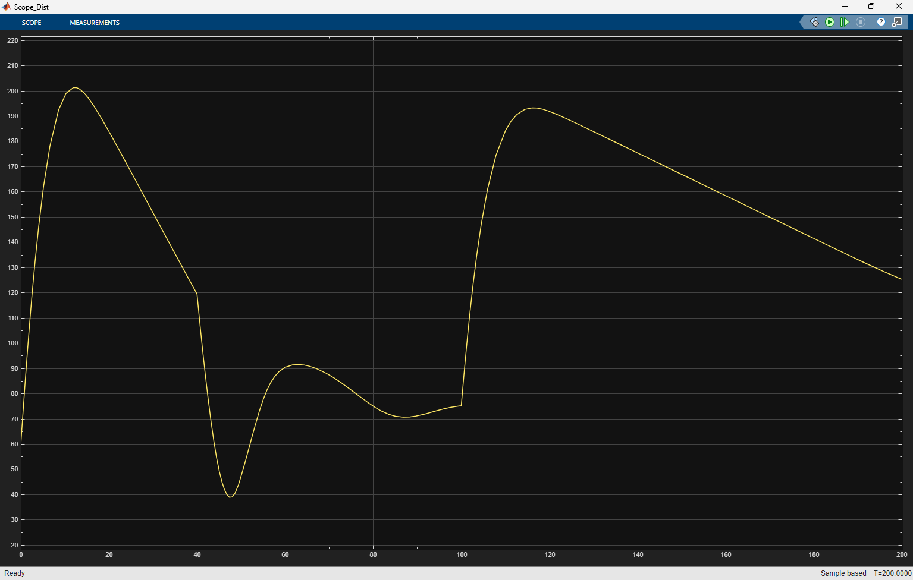
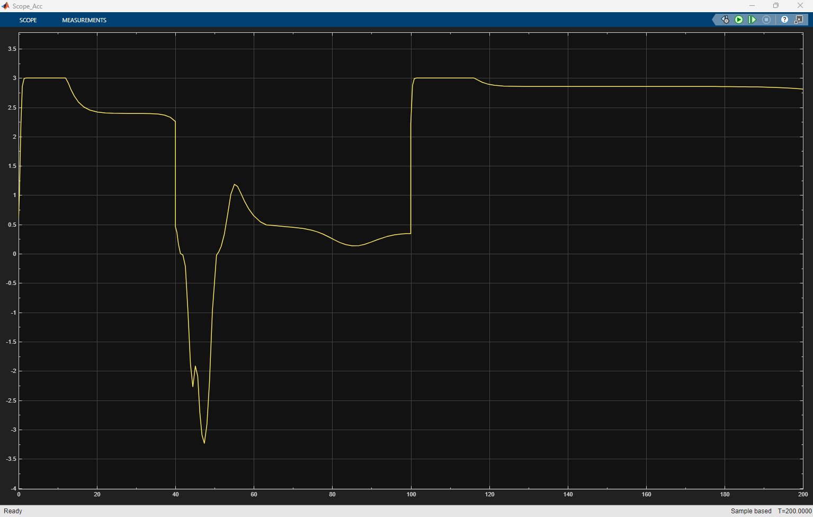
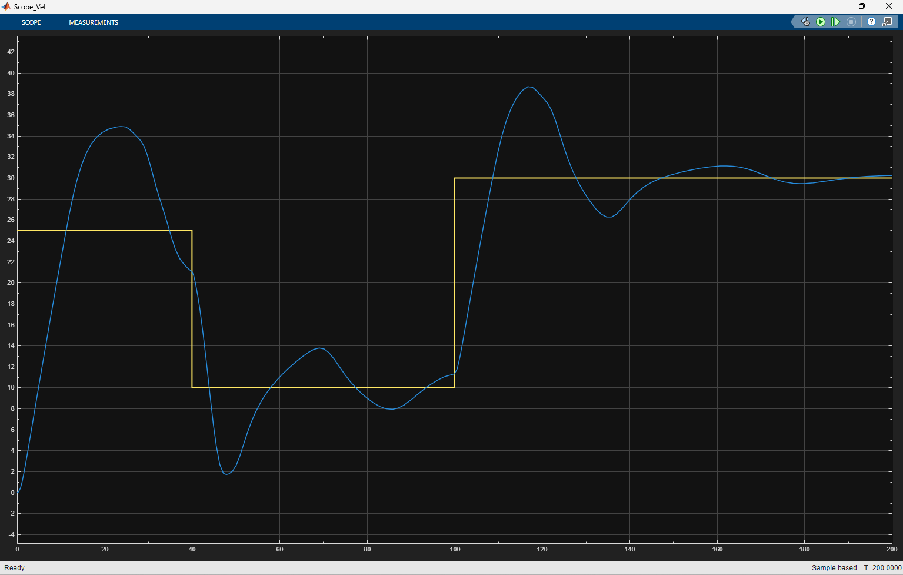
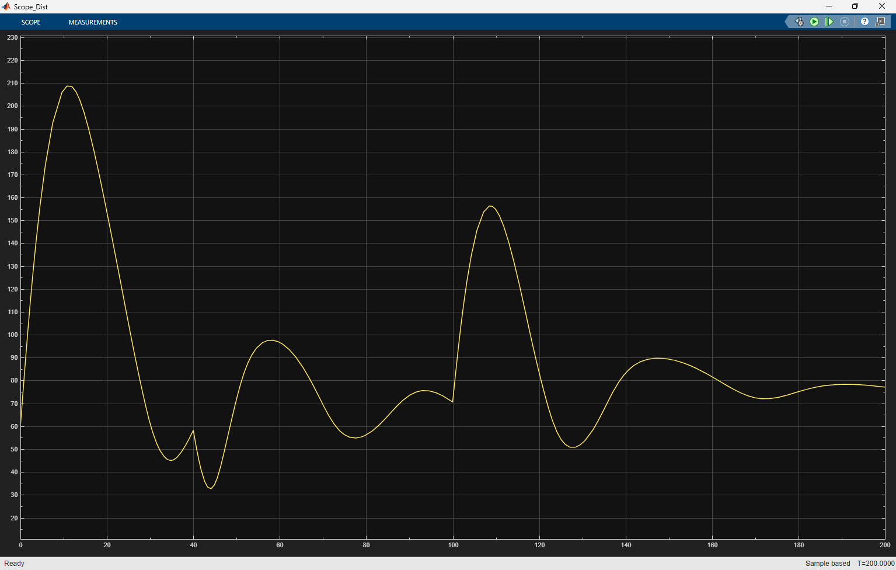
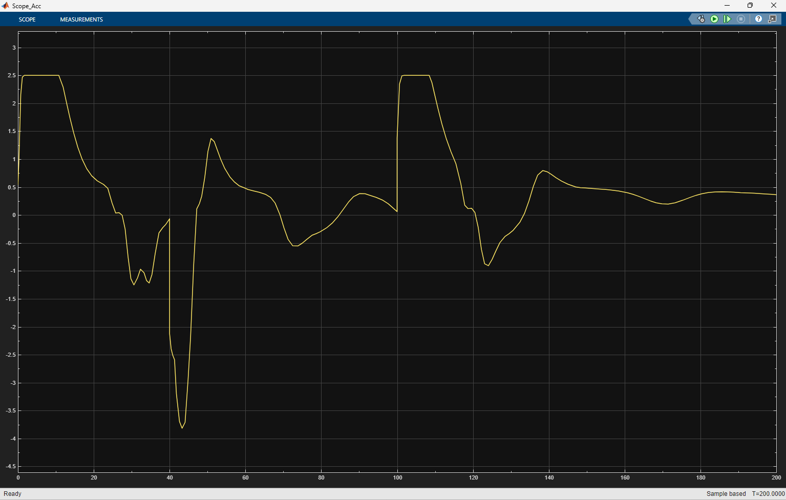

# Adaptive Cruise Control (ACC) Using Sugeno Fuzzy Logic
<p align="center">
  
  
  
  
  
  
</p>
> MATLAB | Simulink | Fuzzy Logic Toolbox | Control Systems

A MATLAB/Simulink implementation of an Adaptive Cruise Control (ACC) system using a Zero-Order Sugeno Fuzzy Inference System. The controller maintains a safe following distance by generating acceleration commands from relative velocity and distance error while accounting for nonlinear vehicle dynamics and actuator lag.

---

## Overview

This project implements an **Adaptive Cruise Control (ACC)** system using a **Zero-Order Sugeno Fuzzy Logic Controller** developed in **MATLAB**, **Simulink**, and the **Fuzzy Logic Toolbox**.

The controller generates acceleration commands from **distance error** and **relative velocity** measurements to maintain a safe following distance behind a lead vehicle. A nonlinear vehicle model incorporating actuator lag, aerodynamic drag, and acceleration limits was used to evaluate controller performance under realistic driving scenarios.

The controller was tested under two vehicle configurations with different aerodynamic drag coefficients, demonstrating stable speed tracking, smooth control action, and robust performance without retuning the fuzzy rule base.

---

## Simulation Overview

The figures below demonstrate the fuzzy controller maintaining a safe following distance while adapting to lead vehicle acceleration, braking, and re-acceleration events under two different vehicle dynamics.

Key observations:

- Smooth velocity tracking
- Safe distance maintenance
- Stable acceleration commands
- Robust performance across different aerodynamic drag conditions

---
# System Overview

<p align="center">

</p>

**Figure 1.** Simulink implementation of the Adaptive Cruise Control system showing the fuzzy controller, actuator lag, nonlinear vehicle dynamics, and closed-loop feedback architecture.

The Adaptive Cruise Control system consists of:

- Lead Vehicle Model
- Ego Vehicle Dynamics
- Sugeno Fuzzy Controller
- Actuator Lag Model
- Aerodynamic Drag Model
- Vehicle Dynamics
- Closed-Loop Feedback

---
# How It Works

The controller computes acceleration commands using:

• Distance Error
• Relative Velocity

These inputs are evaluated by a 15-rule Zero-Order Sugeno FIS whose output is filtered through a first-order actuator model before driving the nonlinear vehicle dynamics.

The resulting vehicle motion updates the spacing and velocity measurements, closing the feedback loop.

Overall signal flow:

```text
Distance Error + Relative Velocity
                │
                ▼
    Sugeno Fuzzy Controller
                │
                ▼
     Acceleration Command
                │
                ▼
          Actuator Lag
                │
                ▼
       Vehicle Dynamics
                │
                ▼
 Updated Position & Velocity
```
---

## Project Highlights

- Designed a Zero-Order Sugeno Fuzzy Logic Controller
- Developed a 15-rule fuzzy inference system
- Built a nonlinear Adaptive Cruise Control model in Simulink
- Modeled actuator lag, aerodynamic drag, and acceleration constraints
- Simulated realistic highway driving scenarios
- Evaluated controller performance under multiple vehicle dynamics
- Demonstrated stable speed tracking and safe following distance

---

  ## Tools & Skills

- MATLAB
- Simulink
- Fuzzy Logic Toolbox
- Sugeno FIS
- Control Systems
- Dynamic System Modeling
- Vehicle Dynamics
- Closed-Loop Control

---

# Controller Inputs

The fuzzy controller uses two input variables.

## Distance Error Membership Functions

Distance Error represents the difference between the desired safe following distance and the measured vehicle spacing.

<p align="center">

</p>

Membership Functions:

- Very Close
- Close
- Safe
- Far
- Very Far

---

## Relative Velocity Membership Functions

Relative Velocity measures the speed difference between the lead vehicle and the ego vehicle.

<p align="center">

</p>

Membership Functions:

- Approaching
- Stable
- Moving Away

---

# Controller Output

The Sugeno controller outputs one of five acceleration commands.

| Output | Acceleration |
|---------|-------------:|
| Brake Hard | -4.0 m/s² |
| Brake Light | -0.8 m/s² |
| Maintain | 0.0 m/s² |
| Accelerate Light | 0.5 m/s² |
| Accelerate Hard | 3.0 m/s² (Case 1) / 2.5 m/s² (Case 2) |

---

# Fuzzy Rule Base

The controller consists of **15 expert driving rules** that determine throttle and braking behavior based on distance error and relative velocity.

Example rules include:

- If Distance is **Very Close** and Relative Velocity is **Approaching**, then **Brake Hard**
- If Distance is **Close** and Relative Velocity is **Stable**, then **Brake Light**
- If Distance is **Safe** and Relative Velocity is **Stable**, then **Maintain Speed**
- If Distance is **Far** and Relative Velocity is **Moving Away**, then **Accelerate Hard**
- If Distance is **Very Far** and Relative Velocity is **Moving Away**, then **Accelerate Hard**

These rules emulate human driving behavior while minimizing oscillations and maintaining safe vehicle spacing.

---

# Simulation Scenarios

Two different vehicle configurations were simulated to evaluate controller robustness.

---
# Results

The controller was evaluated under two different vehicle models.

Both simulations included:

- Initial acceleration
- Sudden braking event
- Re-acceleration

Performance metrics included:

- Velocity tracking
- Following distance
- Controller acceleration
- Stability
- Overshoot
- Settling time
---
# Case 1 – High Aerodynamic Drag

Vehicle Parameters

- Drag Coefficient: **0.003**
- Maximum Acceleration: **3.0 m/s²**

### Velocity Response

<p align="center">

</p>

The controller smoothly tracks the lead vehicle while maintaining stable behavior with minimal overshoot.

---

### Distance Response

<p align="center">

</p>

The controller maintains a safe following distance throughout acceleration, braking, and re-acceleration events.

---

### Acceleration Response

<p align="center">

</p>

The controller generates realistic acceleration and braking commands while respecting actuator limits.

---

# Case 2 – Low Aerodynamic Drag

Vehicle Parameters

- Drag Coefficient: **0.0004**
- Maximum Acceleration: **2.5 m/s²**

### Velocity Response

<p align="center">

</p>

The reduced aerodynamic drag results in faster acceleration and slightly larger overshoot while maintaining overall stability.

---

### Distance Response

<p align="center">

</p>

Although the system experiences larger spacing variations, the controller successfully prevents unsafe following distances.

---

### Acceleration Response

<p align="center">

</p>

Acceleration commands remain smooth and bounded while compensating for the reduced aerodynamic damping.

---

# Performance Comparison

| Performance Metric | Case 1 | Case 2 |
|--------------------|--------|--------|
| Velocity Overshoot | Low | Moderate |
| Settling Time | Moderate | Faster |
| Oscillation | Minimal | Slight |
| Ride Comfort | Excellent | Good |
| Tracking Accuracy | Excellent | Excellent |
| Safety | Excellent | Excellent |

---

## Key Results

- Successfully maintained safe following distance during acceleration and braking events
- Eliminated sustained oscillations through fuzzy rule tuning
- Demonstrated robust controller performance across different aerodynamic drag conditions
- Achieved stable closed-loop behavior without retuning the fuzzy controller

# Skills Demonstrated

This project demonstrates practical experience with:

- MATLAB Programming
- Simulink Modeling
- Fuzzy Logic Control
- Sugeno Inference Systems
- Control Systems
- Vehicle Dynamics
- Adaptive Cruise Control
- Nonlinear Dynamic Systems
- Closed-Loop Feedback Control
- Engineering Simulation
- System Modeling
- Engineering Design

---

# Repository Structure

```
Adaptive-Cruise-Control-Fuzzy-Logic/
│
├── README.md
├── LICENSE
│
├── images/
│   ├── 01-system-overview.png
│   ├── 02-distance-mf.png
│   ├── 03-velocity-mf.png
│   ├── 04-velocity-case1.png
│   ├── 05-velocity-case2.png
│   ├── 06-distance-case1.png
│   ├── 07-distance-case2.png
│   ├── 08-acceleration-case1.png
│   └── 09-acceleration-case2.png
│
├── matlab/
│   ├── ACC_Controller.slx
│   ├── ACC_Fuzzy.fis
│   ├── createFIS.m
│   └── runSimulation.m
│
└── report/
    └── Adaptive_Cruise_Control_Report.pdf
```

---

# Running the Project

1. Open MATLAB.
2. Open the `matlab/` directory.
3. Load `ACC_Controller.slx`.
4. Ensure `ACC_Fuzzy.fis` is in the MATLAB path or the project directory.
5. Run the simulation.
6. Inspect the generated scope outputs for velocity, following distance, spacing error, and controller acceleration.

---

# Future Work

Potential future enhancements include:

- Sensor fusion using radar and LiDAR
- Model Predictive Control (MPC) comparison
- Adaptive membership function tuning
- Automatic rule optimization
- Hardware-in-the-loop (HIL) testing
- Real-time embedded implementation
- Lane keeping integration
- Autonomous vehicle path planning

---

# Report

A detailed technical report describing the controller design, fuzzy rule base, vehicle model, simulation setup, and performance evaluation is included in the **report/** directory.

---

## Connect With Me

Thank you for taking the time to review this project.

If you have questions about this project or would like to discuss engineering opportunities, please feel free to reach out.

- LinkedIn: [https://www.linkedin.com/in/nehoraibachur/](https://www.linkedin.com/in/nehoraibachur/)
- GitHub: [https://github.com/nehoraibar](https://github.com/nehoraibar)
- Email: nehoraibar@gmail.com

---

## License

This project is licensed under the MIT License.
